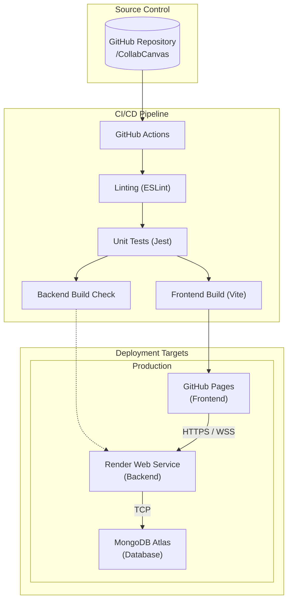
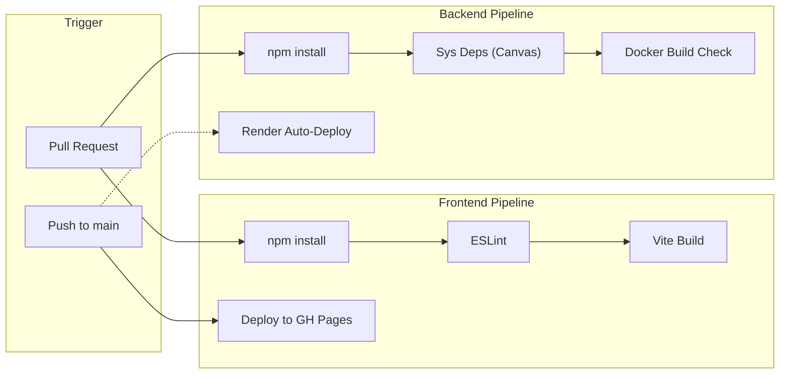

# CollabCanvas DevOps Strategy

This document outlines the DevOps strategy for CollabCanvas, including CI/CD pipelines, deployment workflows, testing strategies, and infrastructure configuration.

## Table of Contents

- [Architecture Overview](#architecture-overview)
- [Component Summary](#component-summary)
- [CI/CD Pipeline](#cicd-pipeline)
- [Deployment Strategy](#deployment-strategy)
- [Testing Strategy](#testing-strategy)
- [Tools and Platforms](#tools-and-platforms)
- [Environment Configuration](#environment-configuration)
- [Monitoring and Observability](#monitoring-and-observability)

## Architecture Overview



## Component Summary

| Component | Source Path | Deployment Location | Technology |
|-----------|-------------------|---------------------|------------|
| **Frontend** | `/frontend` | GitHub Pages | React 19, Vite, TypeScript |
| **Backend** | `/backend` | Render Web Service | Node.js, Express, Socket.io |
| **Database** | N/A | MongoDB Atlas | MongoDB |
| **Infrastructure** | `docker-compose.yml` | Local Dev / CI Check | Docker, Docker Compose |

## CI/CD Pipeline

### Pipeline Architecture



### GitHub Actions Workflows

#### CI Pipeline (`.github/workflows/ci.yml`)

```yaml
name: CI/CD Pipeline

on:
  push:
    branches: [ "main" ]
  pull_request:
    branches: [ "main" ]

jobs:
  build-frontend:
    runs-on: ubuntu-latest
    steps:
    - uses: actions/checkout@v3
    - name: Install Dependencies
      run: |
        cd frontend
        npm install
    - name: Lint
      run: |
        cd frontend
        npm run lint
    - name: Build
      run: |
        cd frontend
        npm run build

  build-backend:
    runs-on: ubuntu-latest
    steps:
    - uses: actions/checkout@v3
    - name: Install System Dependencies
      run: |
        sudo apt-get install -y build-essential libcairo2-dev ...
    - name: Install Dependencies
      run: |
        cd backend
        npm install

  docker-build:
    runs-on: ubuntu-latest
    needs: [build-backend, build-frontend]
    steps:
    - uses: actions/checkout@v3
    - name: Build Docker Images
      run: docker compose build
```

#### Frontend Deploy (`.github/workflows/deploy.yml`)

```yaml
name: Deploy Frontend to GitHub Pages

on:
  push:
    branches: ["main"]

jobs:
  deploy:
    runs-on: ubuntu-latest
    steps:
      - uses: actions/checkout@v3
      - name: Install and Build
        env:
          VITE_API_URL: ${{ secrets.VITE_API_URL }} 
        run: |
          cd frontend
          npm ci
          npm run build
          cp dist/index.html dist/404.html
      - name: Deploy to GitHub Pages
        uses: JamesIves/github-pages-deploy-action@v4
        with:
          folder: frontend/dist
          branch: gh-pages
```

## Deployment Strategy

### Deployment Locations by Environment

| Environment | Frontend | Backend | Database |
|-------------|------------|-----------------|----------|
| **Development** | localhost:5173 (Vite) | localhost:5000 (Node) | MongoDB Atlas (Dev) |
| **Production** | GitHub Pages | Render Web Service | MongoDB Atlas (Prod) |

### Backend Deployment (Render)

The backend is deployed to **Render** as a Web Service.
- **Build Command:** `npm install`
- **Start Command:** `npm start`
- **Auto-Deploy:** Enabled for `main` branch pushes.
- **Environment Variables:** Managed via Render Dashboard.

## Testing Strategy

### Pre-Deployment Checks

#### Frontend

| Check Type | Tool | Command | When |
|------------|------|---------|------|
| **Linting** | ESLint | `npm run lint` | Every CI run |
| **Unit Tests** | Jest | `npm test` | Every CI run (Local) |
| **Build Validation** | Vite | `npm run build` | Every CI run |
| **Type Checking** | TSC | (Implicit in build) | Every CI run |

#### Backend

| Check Type | Tool | Command | When |
|------------|------|---------|------|
| **Dependency Check** | npm | `npm install` | Every CI run |
| **Docker Build** | Docker | `docker compose build` | Every CI run |
| **API Tests** | Jest/Supertest | `npm test` | Planned |

## Tools and Platforms

### Development Tools

| Category | Tool | Purpose |
|----------|------|---------|
| **Runtime (Frontend)** | Node.js / Browser | Runtime environment |
| **Runtime (Backend)** | Node.js v18+ | JavaScript runtime |
| **Linting** | ESLint | Code quality and style |
| **Testing** | Jest | Unit testing |
| **Build Tool** | Vite | Frontend bundler |
| **Containerization** | Docker | Local consistency |

### CI/CD & Infrastructure

| Platform | Purpose |
|----------|---------|
| **GitHub Actions** | CI automation and Frontend CD |
| **GitHub Pages** | Static site hosting (Frontend) |
| **Render** | Backend hosting (Web Service) |
| **MongoDB Atlas** | Managed Database Service |

## Environment Configuration

### Required Secrets

```bash
# Frontend (GitHub Secrets)
VITE_API_URL              # URL of the deployed backend

# Backend (Render Environment Variables)
PORT=5000
MONGO_URI=...            # Connection string for MongoDB Atlas
JWT_SECRET=...           # Secret for token signing
FRONTEND_URL=...         # URL of the deployed frontend (for CORS)
EMAIL_USER=...           # For sending invites (Nodemailer)
EMAIL_PASS=...
```

## Monitoring and Observability

### Strategies

| Metric | Source | Tool |
|--------|--------|------|
| **Application Logs** | Backend | Render Logs / Console |
| **Build Logs** | CI/CD | GitHub Actions Logs |
| **Uptime** | HTTP Check | Render Dashboard / UptimeRobot |
| **Errors** | Exceptions | Sentry (Recommended) |

### Health Checks

A simple health check endpoint should be available to verify backend status.
- **Endpoint:** `GET /health` (Recommended to add)
- **Response:** `200 OK`
